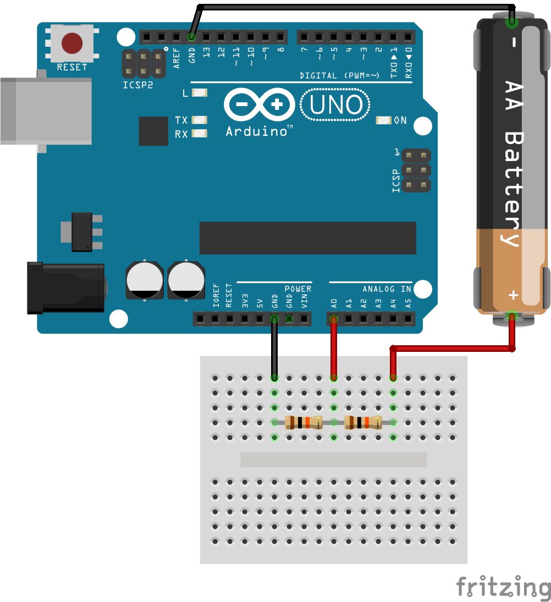

# Simple Arduino battery voltage checker

A simple Arduino project to check voltage status of a battery between 0 and 10V including standard AA,AAA types and LiPo.

## Sketch

The connection is pretty simple, check it out on the sketch bellow. To check your battery you just need to connect your own where the AAA is setup.




## Code

```
int analogPin = A0; // potentiometer wiper (middle terminal) connected 
                    // to analog pin 3 outside leads to ground and +5V
int val = 0;        // variable to store the value read
float vbat = 0.0;

void setup() {
  Serial.begin(9600);           //  setup serial
}

void loop() {
  val = analogRead(analogPin);  // Read analog value from input pin (0 to 1023)
  vbat = float(val);
  vbat = 10.0*vbat/1024.0;      // Convert to voltage note that vcc (5V) is divided by 2
  Serial.println(vbat);
  delay(1000);
}
```


## More information

For more information you can check the projects listed bellow:

 * A [simple project](https://startingelectronics.org/articles/arduino/measuring-voltage-with-arduino/) and nice description about measuring voltage with Arduino. 
 * A more complex [project that includes a LCD viewer](https://www.instructables.com/Arduino-Battery-Voltage-Indicator/).
